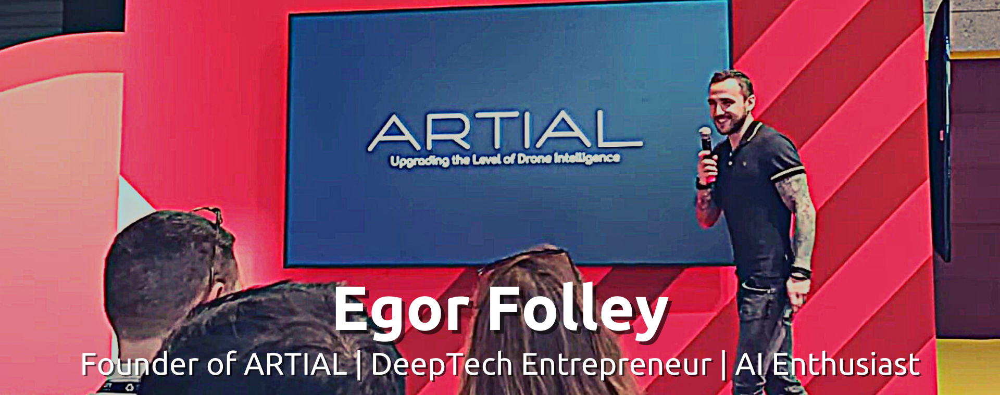

  
   
   
  

<h1 style="font-size:45px">Summary</h1>

 
  A deep tech entrepreneur with a passion for AI. Having a strong expertise in building SaaS & MLOps. Building a better future by providing value to people. 
  
  Experienced in building applications from the bottom. Linux user with with main tech stack in Python & C++. Skillful in leading and managing teams, build pipelines and roadmaps. 
  
  Proficient in business development, from market research and analysis, to marketing and sales with customer negotiations. Creative business analytics with strong organization and leadership. 

<h1 style="font-size:45px">Statistics</h1>

   

