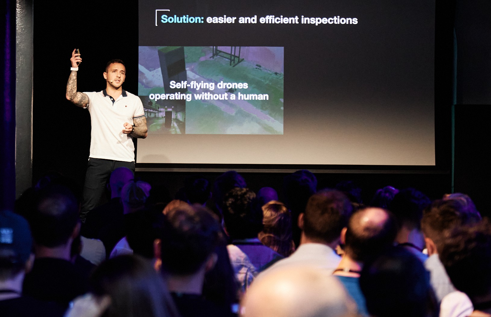

  
   
  

<h1 style="font-size:45px">Summary</h1>

 
  Egor Folley is a tech entrepreneur with a strong background in cutting-edge technologies. Starting with a BSc in robotics and progressing to an experienced AI tech lead in R&D robotics and computer vision, Egor has built a solid foundation in the field.

He pursued a Ph.D. in smart-nano-bio devices at the Institute for Bioengineering of Catalonia (IBEC), where he worked as a researcher before deciding to follow his entrepreneurial ambitions and initiate the startup ARTIAL.

Egor thrives on building companies from 0 to 1, turning innovative ideas into successful ventures. His boldness and determination are essential for success in the fast-paced world of tech startups. In addition to his technical expertise, Egor has a proven track record in securing funding, leading diverse teams, and adapting to market changes through strategic pivots. He is also an alumnus of the Techstars network, having completed the Berlin acceleration program in collaboration with AUDI.

Egor's passion for entrepreneurship, combined with his experience and strategic vision, makes him a valuable asset in the startup ecosystem, constantly pushing the boundaries of technology and business. 

<h1 style="font-size:45px">Statistics</h1>

   

